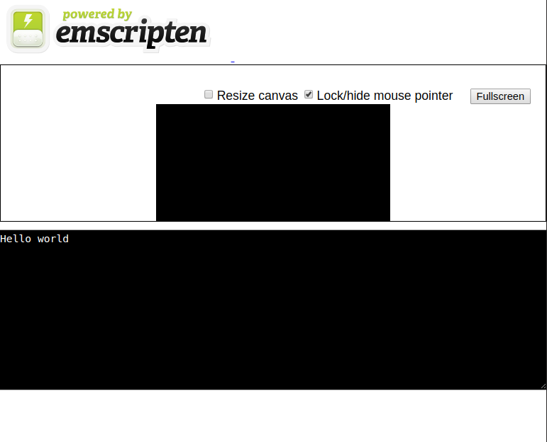

# Web Assembly

So, and I always like to start my read me's with So.

I know quite a bit about C and C++, I would not stay that I am a master at it, but I can write the basic stuff.

## Why use `C/C++`?

The thing was that I could never find a good reason to use either because I generally always do web development or app development using `Swift, PHP and Javascript`.

## How did I get to know about `WASM`? 

Obviously, this was not difficult do to me spending most of my spare time when at home watching either `youtube` or `netflix`.

After watching a couple of videos on youtube about `wasm` I noticed that it would be possible for me to write some code in `C` or `C++` and use it directly in the browser. This makes `wasm` really interesting!

## Creating a Basic (useless) C program 

So, lets start by making the most basic `C`program to get it compiled and running.

```c
#include <stdio.h>

int main(int argc , char ** argv) {

    printf("Hello world\n");

}
```

### Compiling our useless C program

Now lets compile it into a executable called `main` using the flag `-o`.

```bash
gcc -o main main.c
```

### Running our useless program

Now we can run our new amazing application.

```bash
./main
Hello world
```

## Installing all Web Assembly's dependencies

Looking at the following documentation for `wasm` it seems pretty straight forward to me to get this working.

[https://webassembly.org/getting-started/developers-guide/](https://webassembly.org/getting-started/developers-guide/)

I am using `Ubuntu` so I followed the simple `Downloading the ToolChain` steps

```bash
$ git clone https://github.com/juj/emsdk.git
$ cd emsdk
$ ./emsdk install latest
$ ./emsdk activate latest
```

And, it was all installed

## Adding `emsdk` to your PATH

At the end of the `activate` command it provides you with a hint to run the following command so as to add some executable paths to your `PATH` environment variable:

```bash
To conveniently access the selected set of tools from the command line, consider adding the following directories to PATH, or call 'source ./emsdk_env.sh' to do this for you.
```

So I ran this command `source ./emsdk_env.sh` and by the power of grayskull it did what it said it would do and outputted the following stuff.

```bash
#Adding directories to PATH:
PATH+=/home/david/emsdk
PATH+=/home/david/emsdk/clang/e1.38.21_64bit
PATH+=/home/david/emsdk/node/8.9.1_64bit/bin
PATH+=/home/david/emsdk/emscripten/1.38.21

#Setting environment variables:
EMSDK=/home/david/emsdk
EM_CONFIG=/home/david/.emscripten
LLVM_ROOT=/home/david/emsdk/clang/e1.38.21_64bit
EMSCRIPTEN_NATIVE_OPTIMIZER=/home/david/emsdk/clang/e1.38.21_64bit/optimizer
BINARYEN_ROOT=/home/david/emsdk/clang/e1.38.21_64bit/binaryen
EMSDK_NODE=/home/david/emsdk/node/8.9.1_64bit/bin/node
EMSCRIPTEN=/home/david/emsdk/emscripten/1.38.21
```

# Emscripten Compiler Frontend (emcc)

So in order to compile any of your code into web assembly you need to use the `emcc` executable.

After opening the man pages for `emcc` I read the following text which then made it clearer to me what it can compile.

``` 
Command line syntax
===================

   emcc [options] file...

(Note that you will need "./emcc" if you want to run emcc from your
current directory.)

The input file(s) can be either source code files that *Clang* can
handle (C or C++), LLVM bitcode in binary form, or LLVM assembly files
in human-readable form.
```

## Using it blind and trying it out

Rather than spend 10 minutes reading the doc's lets just see if it will compile our C program as is.

```bash
emcc src/main.c
```

### Output

After running the previously command for the very first time I got the fillowing output and also to two files were created `a.out.js` and `a.out.wasm`.

```bash
emscripten:INFO: generating system library: dlmalloc.bc... (this will be cached in "/home/david/.emscripten_cache/asmjs/dlmalloc.bc" for subsequent builds)
emscripten:INFO:  - ok
emscripten:INFO: generating system library: libc.bc... (this will be cached in "/home/david/.emscripten_cache/asmjs/libc.bc" for subsequent builds)
emscripten:INFO:  - ok
emscripten:INFO: generating system library: compiler-rt.a... (this will be cached in "/home/david/.emscripten_cache/asmjs/compiler-rt.a" for subsequent builds)
emscripten:INFO:  - ok
emscripten:INFO: generating system library: wasm-libc.bc... (this will be cached in "/home/david/.emscripten_cache/asmjs/wasm-libc.bc" for subsequent builds)
emscripten:INFO:  - ok
emscripten:INFO: generating system asset: generated_struct_info.json... (this will be cached in "/home/david/.emscripten_cache/asmjs/generated_struct_info.json" for subsequent builds)
emscripten:INFO:  - ok
```

## Reading the documentation for 0.3 seconds 

Lets try it how the documentation says we should do it.

```bash
emcc src/main.c -s WASM=1 -o out/hello.html
```

This then creates the `hello.html` page which we requested for.

## Run the code in the Browser

Following the next step in the doc's it mentions that you can serve the compiled files over `HTTP` by using the `emrun` web server.

```bash
emrun --no_browser --port 8080
```


## What does -s `WASM=1` mean? 

I not ready to go on until I am sure about what the `-s` flag means and why `WASM=1`.

After googling just `-s WASM=1` the first result provided me with the answer.

The `WASM=1` means that the `emcc` should output a `wasm`file too, by default it only outputs the `.js` file as previously seen.

> [Creating HTML and JavaScript](https://developer.mozilla.org/en-US/docs/WebAssembly/C_to_wasm#Creating_HTML_and_JavaScript)

```
The options we’ve passed in with the command are as follows:

-s WASM=1 — Specifies that we want wasm output. If we don’t specify this, Emscripten will just output asm.js, as it does by default.

-o hello.html — Specifies that we want Emscripten to generate an HTML page to run our code in (and a filename to use), as well as the wasm module and the JavaScript "glue" code to compile and instantiate the wasm so it can be used in the web environment.
```
